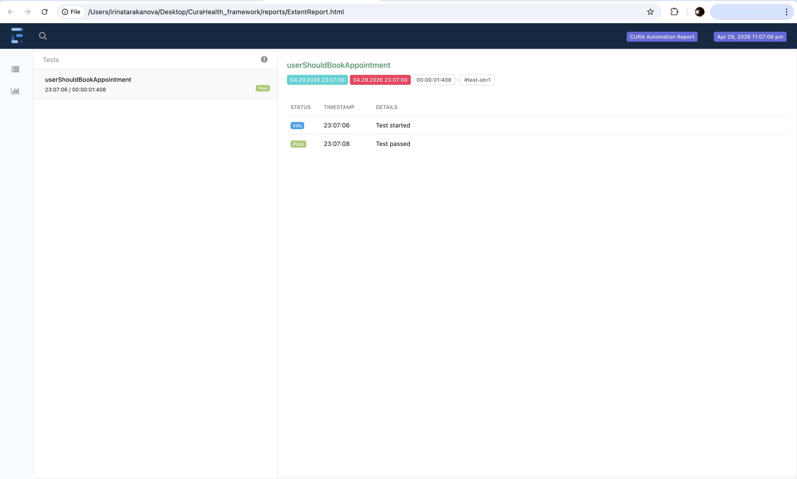

# CURA Healthcare Selenium Framework

End-to-end UI automation framework for the CURA Healthcare demo application.
## Project Overview
This project automates the main user flows of the CURA Healthcare demo application,
including login, appointment booking, and confirmation validation. 
The goal of this project is to demonstrate a real-world style test automation framework using Java, Selenium WebDriver, and TestNG.
## Tech Stack
- Java
- Selenium WebDriver
- TestNG
- Maven
- WebDriverManager
- Page Object Model (POM)
- Log4j 
- JSON tests data 
- ExtentReports

## Automated Scenarios
- Navigate to login page
- Login with valid credentials
- Login with invalid credentials using JSON test data
- Book healthcare appointment
- Validate appointment confirmation details
- Logout successfully

## Framework Structure
```text
CuraHealth_framework
├── reports
├── screenshots
├── src
│   └── test
│       ├── java
│       │   └── tarakanova
│       │       ├── base
│       │       ├── pages
│       │       ├── tests
│       │       └── utils
│       └── resources
│           ├── log4j2.xml
│           └── testdata
│               └── loginData.json
├── pom.xml
└── README.md

## Features

- Page Object Model structure
- BasePage with reusable methods
- Page navigation using method chaining
- Explicit waits
- Positive and negative test scenarios
- Data-driven testing with TestNG DataProvider
- External test data from JSON
- Log4j logging
- RetryAnalyzer for flaky test retry
- TestNG Listener
- Screenshots on failure

### Extent Report Preview



## Key Improvements

- Fixed flaky tests by moving waits into Page Objects
- Implemented proper page navigation (Login → Appointment → Confirmation)
- Ensured each page method waits before returning next page
## Author
Irina Tarakanova